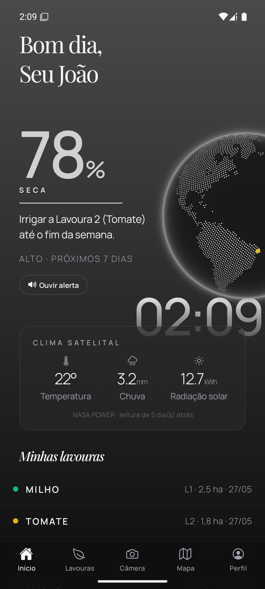
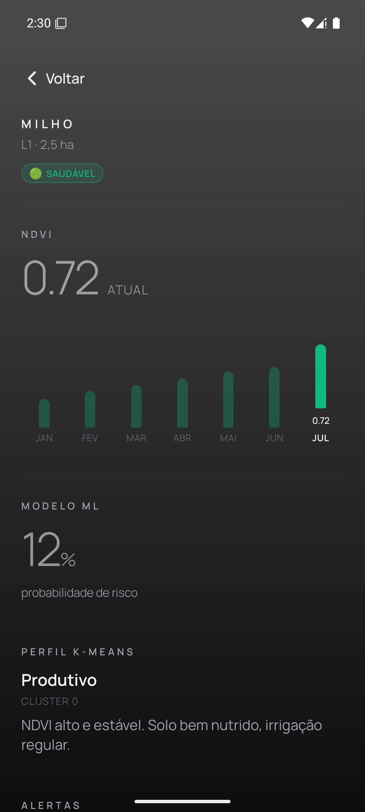
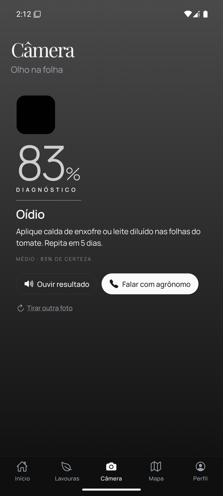
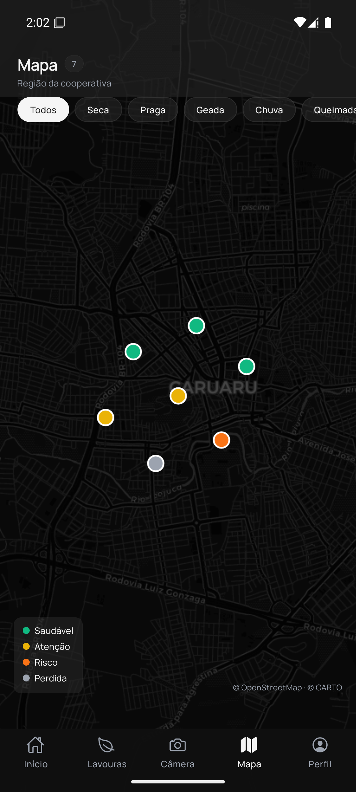
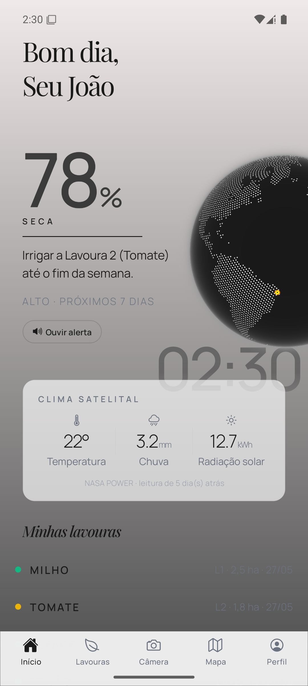

# 2F-AGRO Mobile

> *"Lançamos satélites no espaço. Está na hora de eles olharem pra cá também."*

**2F-AGRO** é uma plataforma mobile de tecnologia espacial acessível para o pequeno agricultor familiar brasileiro. O app transforma dados de satélites — como índices de vegetação (NDVI) obtidos via Sentinel-2, previsões climáticas da NASA POWER e alertas meteorológicos do CPTEC-INPE — em informações simples e acionáveis, direto no celular do produtor.

A persona central é o **Seu João**, agricultor familiar do interior de Pernambuco, que precisa proteger sua lavoura contra secas, pragas e geadas, mas não tem acesso a consultoria agronômica especializada. O 2F-AGRO leva até ele o mesmo tipo de dado que grandes produtores usam — só que traduzido em linguagem clara, com suporte a leitura em voz alta (TTS) e interface acessível.

**Global Solution FIAP 2026.1** — Engenharia de Software 3ES — Tema: **Indústria Espacial / Space Connect**

---

## Conexão com o Tema: Indústria Espacial

O 2F-AGRO conecta a **economia espacial** diretamente à agricultura familiar brasileira:

- **Dados de satélite (Sentinel-2, NASA POWER):** o app consome índices NDVI (Normalized Difference Vegetation Index) derivados de imagens de satélite para monitorar a saúde de cada lavoura ao longo do tempo, exibindo gráficos temporais de 12 meses.
- **Previsão climática espacial (CPTEC-INPE):** alertas de seca, geada, chuva forte e queimada são gerados a partir de modelos meteorológicos alimentados por sensoriamento remoto orbital.
- **Visão computacional (YOLOv8):** a câmera do celular, combinada com modelos de IA treinados em datasets como o PlantVillage, detecta pragas e doenças nas folhas — uma aplicação terrestre de técnicas de análise de imagem originadas na observação espacial.
- **Modelos de ML com dados espaciais:** regressão, classificação e clusterização (K-Means) aplicados sobre dados de risco agrícola enriquecidos com variáveis orbitais.

### ODS da ONU atendidos

| ODS | Descrição | Como o 2F-AGRO contribui |
|-----|-----------|--------------------------|
| **1** — Erradicação da Pobreza | Reduzir vulnerabilidade econômica | Alertas antecipados evitam perdas de safra que empobrecem famílias |
| **2** — Fome Zero | Agricultura sustentável | Monitoramento de saúde da lavoura e detecção precoce de pragas |
| **8** — Trabalho Decente | Acesso a tecnologia produtiva | Democratiza ferramentas antes restritas a grandes produtores |
| **13** — Ação Contra a Mudança Global do Clima | Adaptação climática | Previsões e alertas baseados em sensoriamento remoto |
| **15** — Vida Terrestre | Proteção de ecossistemas | Manejo integrado de pragas, redução de agrotóxicos |

---

## Funcionalidades Implementadas

### Recursos obrigatórios da disciplina

| Recurso | Implementação no 2F-AGRO | Onde no código |
|---------|--------------------------|----------------|
| **Expo Router** (3+ rotas) | 8 rotas: Home, Lavouras, Câmera, Cooperativa, Perfil (5 tabs) + Detalhe da Lavoura (`lavoura/[id]`) + Detalhe do Alerta (`alerta/[id]`) + Login | `app/(tabs)/`, `app/lavoura/`, `app/alerta/`, `app/login.tsx` |
| **useState / useEffect** | Gerenciamento de estado local em todas as telas (câmera state machine, filtros do mapa, animações, formulários) | `app/(tabs)/camera.tsx`, `app/(tabs)/cooperativa.tsx`, `app/(tabs)/index.tsx` |
| **Context API** | 4 contextos globais: `ThemeContext` (tema claro/escuro), `TTSContext` (velocidade da leitura em voz alta), `UserLocationContext` (dados da propriedade), `LocaleContext` (idioma) | `context/` |
| **AsyncStorage** | Leitura **e** escrita: tema persistido (`@2f-agro/theme_v1`), velocidade TTS (`@2f-agro/tts_speed`), sessão do usuário (`@2f-agro/session`), cache do React Query (`@2f-agro/react-query-cache`), fila offline (`@2f-agro/offline-queue`), locale (`@2f-agro/locale`), onboarding (`@2f-agro/onboarded`) | `lib/storage-keys.ts`, `context/ThemeContext.tsx`, `context/TTSContext.tsx` |
| **Formulário com validação** | Tela de login com campos de e-mail e senha + validação (e-mail válido, senha min. 6 caracteres, campo obrigatório). Funções de validação com i18n | `app/login.tsx`, `lib/validation.ts` |
| **Dashboards / Gráficos** | Home ("Sua Roça Hoje") com hero de alerta + grid de lavouras; Detalhe da Lavoura com gráfico NDVI temporal (12 meses) + indicadores de risco ML + cluster K-Means; Mapa da cooperativa com marcadores georreferenciados | `app/(tabs)/index.tsx`, `app/lavoura/[id].tsx`, `components/domain/NdviChart.tsx` |
| **Componentização** | 15+ componentes reutilizáveis em `components/ui/`, 6 componentes de domínio em `components/domain/`, separação clara UI × lógica × dados | `components/` |
| **Estilização coerente** | Design system com tokens semânticos (light/dark), tipografia editorial (Playfair Display + Manrope), glass morphism, gradientes, mesh backgrounds | `lib/theme.ts` |

### Funcionalidades adicionais (diferenciais)

- **TypeScript strict** em 100% do projeto (zero `any`)
- **Câmera nativa** (`expo-camera`) com fluxo completo: permissão → captura → análise → resultado de diagnóstico
- **Tema claro/escuro** dinâmico com transição animada, persistido via AsyncStorage
- **TTS (Text-to-Speech)** em alertas e diagnósticos — acessibilidade para agricultores com dificuldade de leitura
- **Globo 3D interativo** (biblioteca `cobe`) na Home mostrando localização da fazenda
- **Mapa interativo** (`react-native-maps`) com marcadores coloridos por saúde da lavoura, filtros por tipo de alerta e callouts informativos
- **Animações** com `react-native-reanimated` (fade-in, shake)
- **Feedback háptico** (`expo-haptics`) em interações críticas
- **Cache offline** (React Query + AsyncStorage persister) + fila de mutações offline (Zustand)
- **Internacionalização** (i18next) preparada para múltiplos idiomas
- **Armazenamento seguro** de JWT via `expo-secure-store`

---

## Telas do App

| # | Tela | Descrição |
|---|------|-----------|
| 1 | **Login** | Autenticação com campos de e-mail e senha, validação em tempo real |
| 2 | **Home — "Sua Roça Hoje"** | Dashboard principal: saudação temporal, globo 3D, card hero de alerta com probabilidade (%) e recomendação, grid das 6 lavouras, botões de ação rápida |
| 3 | **Lavouras** | Lista completa de todas as lavouras com status de saúde, cultura e área |
| 4 | **Detalhe da Lavoura** | NDVI atual + gráfico temporal de 12 meses, probabilidade de risco (ML), cluster K-Means, alertas ativos, ações recomendadas |
| 5 | **Câmera — "Olho na Folha"** | Captura de foto da folha → análise de IA → diagnóstico de praga com tipo, confiança (%) e recomendação |
| 6 | **Cooperativa — Mapa** | Mapa com marcadores de propriedades vizinhas, filtro por tipo de alerta, legenda de saúde semafórica |
| 7 | **Perfil** | Avatar, dados da propriedade, alternância tema claro/escuro, velocidade do TTS, idioma, logout |
| 8 | **Detalhe do Alerta** | Probabilidade, severidade, recomendação prática e botão 🔊 Ouvir (TTS) — acessibilidade pro agricultor |

---

## Stack Técnica

| Camada | Tecnologia |
|--------|------------|
| Framework | React Native 0.83 + Expo SDK 55 (managed workflow) |
| Linguagem | TypeScript 5.9 (strict mode) |
| Navegação | Expo Router (file-based routing) |
| Estado global | Context API (4 contextos) + Zustand (fila offline) |
| Dados remotos | React Query 5 (TanStack) + cache persistido |
| Persistência local | AsyncStorage + Expo SecureStore (JWT) |
| Mapas | react-native-maps 1.27 |
| Câmera | expo-camera 55 |
| Acessibilidade | expo-speech (TTS), expo-haptics |
| Animações | react-native-reanimated 4.2 |
| Tipografia | Playfair Display + Manrope (Google Fonts) |
| i18n | i18next + react-i18next |
| Visualização 3D | cobe (globo pontilhado) |

---

## Instalação e Execução

### Pré-requisitos

- **Node.js** 18+ instalado
- **npm** ou **yarn**
- **Expo Go** instalado no celular ([Android](https://play.google.com/store/apps/details?id=host.exp.exponent) | [iOS](https://apps.apple.com/app/expo-go/id982107779))
- Celular e computador na **mesma rede Wi-Fi**

### Passo a passo

```bash
# 1. Clone o repositório
git clone https://github.com/GS-SPACE-CONNECT/2f-agro-mobile.git
cd 2f-agro-mobile

# 2. Instale as dependências
npm install

# 3. Inicie o servidor de desenvolvimento
npx expo start

# 4. Escaneie o QR Code
#    - Android: abra o app Expo Go e escaneie o QR Code do terminal
#    - iOS: abra a câmera nativa e aponte para o QR Code
```

### Login de demonstração

A autenticação é mock no protótipo: **qualquer e-mail válido + senha com 6+ caracteres** entra. Sugestão:

```text
Email: seujoao@2fagro.com.br
Senha: roca2026
```

### Variáveis de ambiente (opcional)

O app funciona com **dados mockados** por padrão (sem necessidade de backend). Para conectar ao backend .NET:

```bash
# Crie um arquivo .env na raiz (não commitado)
EXPO_PUBLIC_API_URL=http://seu-ip:5000/api
```

---

## Estrutura do Projeto

```
2f-agro-mobile/
├── app/                        # Expo Router — rotas (file-based)
│   ├── _layout.tsx             # Layout raiz com providers
│   ├── login.tsx               # Tela de login
│   ├── (tabs)/                 # Navegação por abas (5 tabs)
│   │   ├── _layout.tsx         # Configuração da tab bar
│   │   ├── index.tsx           # Home — "Sua Roça Hoje"
│   │   ├── lavouras.tsx        # Lista de lavouras
│   │   ├── camera.tsx          # Diagnóstico de pragas
│   │   ├── cooperativa.tsx     # Mapa da cooperativa
│   │   └── profile.tsx         # Perfil e configurações
│   ├── lavoura/[id].tsx        # Detalhe da lavoura (NDVI + ML)
│   └── alerta/[id].tsx         # Detalhe do alerta
├── components/
│   ├── domain/                 # Componentes de negócio
│   │   ├── AlertCardHero/      # Card hero de alerta
│   │   ├── DiagnosticoCard/    # Resultado do diagnóstico
│   │   ├── LavouraRow/         # Item de lavoura na lista
│   │   └── NdviChart/          # Gráfico NDVI temporal
│   ├── illustrations/          # Globe 3D, RotatingClock
│   └── ui/                     # Primitivas reutilizáveis
│       ├── Button, Card, Input, Badge
│       ├── AppBackground, GlassSurface
│       ├── ScreenHeader, ProfileAvatar
│       ├── EmptyState, ErrorBanner
│       └── Toast, LoadingScreen
├── context/                    # Context API
│   ├── ThemeContext.tsx         # Tema claro/escuro (AsyncStorage)
│   ├── TTSContext.tsx           # Velocidade do TTS (AsyncStorage)
│   ├── UserLocationContext.tsx  # Dados da propriedade
│   └── LocaleContext.tsx       # Idioma (i18n)
├── hooks/                      # Hooks customizados
│   ├── useQueries.ts           # React Query hooks
│   ├── useFadeIn.ts            # Animação de entrada
│   └── useShake.ts             # Feedback de erro
├── i18n/                       # Internacionalização
│   └── pt-BR.json              # Dicionário completo
├── lib/                        # Utilitários e serviços
│   ├── api.ts                  # API client (mock/real)
│   ├── auth.ts                 # Autenticação (JWT)
│   ├── theme.ts                # Design tokens e paletas
│   ├── types.ts                # Tipos do domínio
│   ├── validation.ts           # Regras de validação
│   ├── storage-keys.ts         # Chaves do AsyncStorage
│   ├── offline-queue.ts        # Fila de mutações offline
│   ├── query-client.ts         # React Query config
│   └── mock-data.ts            # Dados mockados (Sprint 1)
└── assets/                     # Imagens, ícones, fontes
```

---

## Vídeo de Demonstração

🎥 **[Assista à demo (3 min) — Google Drive](https://drive.google.com/file/d/1KuqM0XDjQWW6iVrAE4eCxZrRCGGswDdU/view?usp=sharing)** — app completo rodando: login, dashboards, diagnóstico por câmera, mapa da cooperativa, TTS e modo offline.

---

## Capturas de Tela

| Login | Home — "Sua Roça Hoje" | Detalhe da Lavoura (NDVI + ML) | Câmera — Diagnóstico |
|:---:|:---:|:---:|:---:|
|  |  |  |  |

| Cooperativa — Mapa | Perfil e Configurações | Tema Claro |
|:---:|:---:|:---:|
|  |  |  |

---

## Integrantes

| Nome | RM | GitHub |
|------|----|--------|
| João Victor Franco | 556790 | [@jota0802](https://github.com/jota0802) |
| Bruno Leão | 555563 | [@brnleao](https://github.com/brnleao) |
| Ruan Melo | 557599 | [@DevRuanVieira](https://github.com/DevRuanVieira) |
| Lucca Borges | 554608 | [@lucksza](https://github.com/lucksza) |
| Rodrigo Jimenez | 558148 | [@roji-menez](https://github.com/roji-menez) |

**Organização GitHub:** [GS-SPACE-CONNECT](https://github.com/GS-SPACE-CONNECT)

---

## Referências

- [NASA POWER](https://power.larc.nasa.gov/) — dados climáticos de satélite
- [CPTEC-INPE](https://www.cptec.inpe.br/) — previsão meteorológica brasileira
- [Sentinel-2 (ESA)](https://www.esa.int/Applications/Observing_the_Earth/Copernicus/Sentinel-2) — imagens para NDVI
- [International Charter Space and Major Disasters](https://disasterscharter.org/) — precedente legal
- [ODS da ONU](https://brasil.un.org/pt-br/sdgs) — Objetivos de Desenvolvimento Sustentável
- [PlantVillage Dataset](https://plantvillage.psu.edu/) — dataset de doenças em folhas

---

## Atribuição

Código portado e adaptado do projeto pessoal anterior:
[`fwd-ford/forward-mobile`](https://github.com/fwd-ford/forward-mobile) (FIAP — projeto anterior).
Estética, layout primitives e theming foram reaproveitados; domínio reescrito para o contexto agrícola.
Spec do port: [`docs/specs/2026-05-28-2f-agro-mobile-base-from-forward-design.md`](https://github.com/GS-SPACE-CONNECT/2f-agro/blob/main/docs/specs/2026-05-28-2f-agro-mobile-base-from-forward-design.md)

## Licença

MIT — uso acadêmico.
